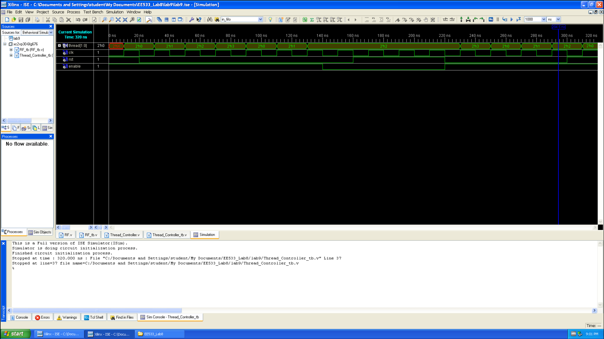
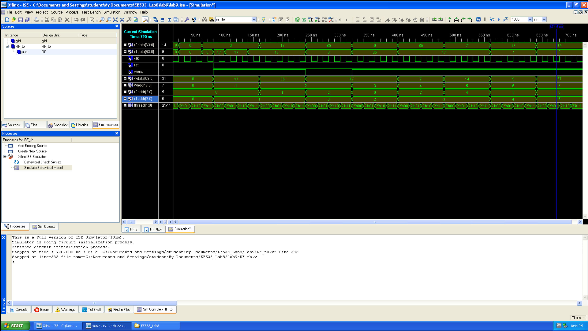

# EE533 Lab9 Report
## 1. Multi Thread Support

### 1.1 Thread Controller

The thread controller is responsible for thread switching

#### 1.1.1 Thread Controller Verilog File

````
`timescale 1ns / 1ps

module Thread_Controller
(
    input clk,
    input rst,
    input enable,

    output reg [1:0] thread
);
    always @(posedge clk) begin
        if(rst && enable) thread = 0;
        else if(enable) thread = thread + 1'b1;
    end
endmodule
````

#### 1.1.2 Thread Controller Testbench

````
`timescale 1ns / 1ps

module Thread_Controller_tb();
    reg clk;
    reg rst;
    reg enable;

    wire [1:0] thread;

    Thread_Controller uut (
        .clk(clk),
        .rst(rst),
        .enable(enable),

        .thread(thread)
    );

    always #10 clk = ~clk;

    initial begin
        #0  rst = 1; enable = 1; clk = 0;  // initial reset
        #20 rst = 0; 
        #20;
        #20;
        #20;
        #20;
        #20;
        #20 enable = 0;
        #20 rst = 1;
        #20;
        #20;
        #20 rst = 0; enable = 1;
        #20;
        #20;
        #20;
        #20 rst = 1;
        #20 $stop;
    end
endmodule
````

#### 1.1.3 Testbench Result



### 1.2 Register File

Adding multithread support for the register file.

#### 1.2.1 Register File Verilog File

````
`timescale 1ns / 1ps

module RF
(
    input clk,
    input rst,
    input wena,
    input [63:0] wdata,
    input [2:0] waddr,
    input [2:0] r0addr,
    input [2:0] r1addr,
    input [1:0] thread,

    output reg [63:0] r0data,
    output reg [63:0] r1data
);

    reg signed [63:0] RF1 [7:0];
    reg signed [63:0] RF2 [7:0];
    reg signed [63:0] RF3 [7:0];
    reg signed [63:0] RF4 [7:0];

	integer i;

    always @(posedge clk) begin
        case(thread)
            2'b00: begin  // thread 1
                if (rst) begin
                    for (i = 0; i < 8; i = i + 1) RF1[i] <= 64'b0;
                end else if (wena) RF1[waddr] <= wdata;
            end
            2'b01: begin  // thread 2
                if (rst) begin
                    for (i = 0; i < 8; i = i + 1) RF2[i] <= 64'b0;
                end else if (wena) RF2[waddr] <= wdata;
            end
            2'b01: begin  // thread 3
                if (rst) begin
                    for (i = 0; i < 8; i = i + 1) RF3[i] <= 64'b0;
                end else if (wena) RF3[waddr] <= wdata;
            end
            2'b11: begin  // thread 4
                if (rst) begin
                    for (i = 0; i < 8; i = i + 1) RF4[i] <= 64'b0;
                end else if (wena) RF4[waddr] <= wdata;
            end
        endcase

    end

    always @(*) begin
        case(thread)
            2'b00: begin  // thread 1
                r0data = ((waddr == r0addr) && wena) ? RF1[waddr] : RF1[r0addr];
                r1data = ((waddr == r1addr) && wena) ? RF1[waddr] : RF1[r1addr];
            end
            2'b01: begin  // thread 2
                r0data = ((waddr == r0addr) && wena) ? RF2[waddr] : RF2[r0addr];
                r1data = ((waddr == r1addr) && wena) ? RF2[waddr] : RF2[r1addr];
            end
            2'b01: begin  // thread 3
                r0data = ((waddr == r0addr) && wena) ? RF3[waddr] : RF3[r0addr];
                r1data = ((waddr == r1addr) && wena) ? RF3[waddr] : RF3[r1addr];
            end
            2'b11: begin  // thread 4
                r0data = ((waddr == r0addr) && wena) ? RF4[waddr] : RF4[r0addr];
                r1data = ((waddr == r1addr) && wena) ? RF4[waddr] : RF4[r1addr];
            end
        endcase
    end
    // assign r0data = ((waddr == r0addr) && wena) ? RF[waddr] : RF[r0addr];
    // assign r1data = ((waddr == r1addr) && wena) ? RF[waddr] : RF[r1addr];

endmodule
````

#### 1.2.2 Register File TestBench

````
`timescale 1ns / 1ps

////////////////////////////////////////////////////////////////////////////////
// Company: 
// Engineer:
//
// Create Date:   15:53:18 03/01/2025
// Design Name:   RF
// Module Name:   E:/Documents and Settings/student/EE533_Lab7/RF_tb.v
// Project Name:  EE533_Lab7
// Target Device:  
// Tool versions:  
// Description: 
//
// Verilog Test Fixture created by ISE for module: RF
//
// Dependencies:
// 
// Revision:
// Revision 0.01 - File Created
// Additional Comments:
// 
////////////////////////////////////////////////////////////////////////////////

module RF_tb;

	// Inputs
	reg clk;
	reg rst;
	reg wena;
	reg [63:0] wdata;
	reg [2:0] waddr;
	reg [2:0] r0addr;
	reg [2:0] r1addr;
    reg [1:0] thread;

	// Outputs
	wire [63:0] r0data;
	wire [63:0] r1data;

	// Instantiate the Unit Under Test (UUT)
	RF uut (
		.clk(clk), 
		.rst(rst), 
		.wena(wena), 
		.wdata(wdata), 
		.waddr(waddr), 
		.r0addr(r0addr), 
		.r1addr(r1addr), 
		.r0data(r0data), 
		.r1data(r1data),
        .thread(thread)
	);

	always #10 clk = ~clk;

	initial begin
		// Initialize Inputs
        clk = 1;
		rst = 1;
		wena = 0;
		wdata = 0;
		waddr = 0;
		r0addr = 0;
		r1addr = 0;
        
		// Wait 20 ns for global reset to finish on all 4 RF
        thread = 2'b00;
        #20;
        thread = 2'b01;
        #20;
        thread = 2'b10;
        #20;
        thread = 2'b11;
		#20;
		rst = 0;
        
		// Add stimulus here
        thread = 2'b00;
        wena = 1;
        waddr = 3'd1;
        wdata = 64'd17;
        r0addr = 3'b000;
        r1addr = 3'b001;
        #20;

        thread = 2'b01;
        wena = 1;
        waddr = 3'd1;
        wdata = 64'd17;
        r0addr = 3'b000;
        r1addr = 3'b001;
        #20;

        thread = 2'b10;
        wena = 1;
        waddr = 3'd1;
        wdata = 64'd17;
        r0addr = 3'b000;
        r1addr = 3'b001;
        #20;

        thread = 2'b11;
        wena = 1;
        waddr = 3'd1;
        wdata = 64'd17;
        r0addr = 3'b000;
        r1addr = 3'b001;
        #20;

        thread = 2'b00;
        wena = 1;
        waddr = 3'd2;
        wdata = 64'd85;
        r0addr = 3'd1;
        r1addr = 3'd1;
        #20;

        thread = 2'b01;
        wena = 1;
        waddr = 3'd2;
        wdata = 64'd85;
        r0addr = 3'd1;
        r1addr = 3'd1;
        #20;

        thread = 2'b10;
        wena = 1;
        waddr = 3'd2;
        wdata = 64'd85;
        r0addr = 3'd1;
        r1addr = 3'd1;
        #20;

        thread = 2'b11;
        wena = 1;
        waddr = 3'd2;
        wdata = 64'd85;
        r0addr = 3'd1;
        r1addr = 3'd1;
        #20;

        thread = 2'b00;
        wena = 0;
        waddr = 3'd2;
        wdata = 64'd17;
        r0addr = 3'd2;
        r1addr = 3'd3;
        #20;

        thread = 2'b01;
        wena = 0;
        waddr = 3'd2;
        wdata = 64'd17;
        r0addr = 3'd2;
        r1addr = 3'd3;
        #20;

        thread = 2'b10;
        wena = 0;
        waddr = 3'd2;
        wdata = 64'd17;
        r0addr = 3'd2;
        r1addr = 3'd3;
        #20;

        thread = 2'b11;
        wena = 0;
        waddr = 3'd2;
        wdata = 64'd17;
        r0addr = 3'd2;
        r1addr = 3'd3;
        #20;

        thread = 2'b00;
        wena = 1;
        waddr = 3'd3;
        wdata = 64'd17;
        r0addr = 3'd0;
        r1addr = 3'd2;
        #20;

        thread = 2'b01;
        wena = 1;
        waddr = 3'd3;
        wdata = 64'd17;
        r0addr = 3'd0;
        r1addr = 3'd2;
        #20;

        thread = 2'b10;
        wena = 1;
        waddr = 3'd3;
        wdata = 64'd17;
        r0addr = 3'd0;
        r1addr = 3'd2;
        #20;

        thread = 2'b11;
        wena = 1;
        waddr = 3'd3;
        wdata = 64'd17;
        r0addr = 3'd0;
        r1addr = 3'd2;
        #20;

        thread = 2'b00;
        wena = 1;
        waddr = 3'd4;
        wdata = 64'd7;
        r0addr = 3'd2;
        r1addr = 3'd3;
        #20;

        thread = 2'b01;
        wena = 1;
        waddr = 3'd4;
        wdata = 64'd7;
        r0addr = 3'd2;
        r1addr = 3'd3;
        #20;

        thread = 2'b10;
        wena = 1;
        waddr = 3'd4;
        wdata = 64'd7;
        r0addr = 3'd2;
        r1addr = 3'd3;
        #20;

        thread = 2'b11;
        wena = 1;
        waddr = 3'd4;
        wdata = 64'd7;
        r0addr = 3'd2;
        r1addr = 3'd3;
        #20;

        thread = 2'b00;
        wena = 1;
        waddr = 3'd5;
        wdata = 64'd14;
        r0addr = 3'd4;
        r1addr = 3'd3;
        #20;

        thread = 2'b01;
        wena = 1;
        waddr = 3'd5;
        wdata = 64'd14;
        r0addr = 3'd4;
        r1addr = 3'd3;
        #20;

        thread = 2'b10;
        wena = 1;
        waddr = 3'd5;
        wdata = 64'd14;
        r0addr = 3'd4;
        r1addr = 3'd3;
        #20;

        thread = 2'b11;
        wena = 1;
        waddr = 3'd5;
        wdata = 64'd14;
        r0addr = 3'd4;
        r1addr = 3'd3;
        #20;

        thread = 2'b00;
        wena = 1;
        waddr = 3'd6;
        wdata = 64'd9;
        r0addr = 3'd1;
        r1addr = 3'd4;
        #20;

        thread = 2'b01;
        wena = 1;
        waddr = 3'd6;
        wdata = 64'd9;
        r0addr = 3'd1;
        r1addr = 3'd4;
        #20;

        thread = 2'b10;
        wena = 1;
        waddr = 3'd6;
        wdata = 64'd9;
        r0addr = 3'd1;
        r1addr = 3'd4;
        #20;

        thread = 2'b11;
        wena = 1;
        waddr = 3'd6;
        wdata = 64'd9;
        r0addr = 3'd1;
        r1addr = 3'd4;
        #20;

        thread = 2'b00;
        wena = 1;
        waddr = 3'd7;
        wdata = 64'd31;
        r0addr = 3'd5;
        r1addr = 3'd6;
        #20;

        thread = 2'b01;
        wena = 1;
        waddr = 3'd7;
        wdata = 64'd31;
        r0addr = 3'd5;
        r1addr = 3'd6;
        #20;

        thread = 2'b10;
        wena = 1;
        waddr = 3'd7;
        wdata = 64'd31;
        r0addr = 3'd5;
        r1addr = 3'd6;
        #20;

        thread = 2'b11;
        wena = 1;
        waddr = 3'd7;
        wdata = 64'd31;
        r0addr = 3'd5;
        r1addr = 3'd6;
        #20;

        $stop;
	end
      
endmodule
````

#### 1.2.3 Testbench Result



### 1.3 Program Counter

Adding multithread support for the program counter.

#### 1.3.1 Program Counter Verilog File

````
````

#### 1.3.2 Program Counter Testbench

````
````